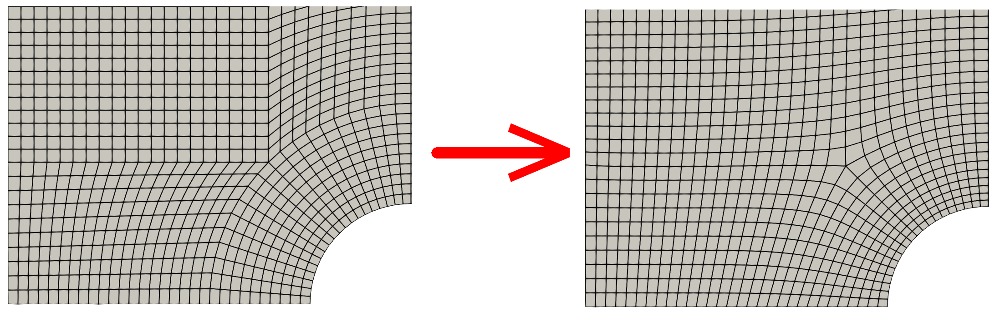
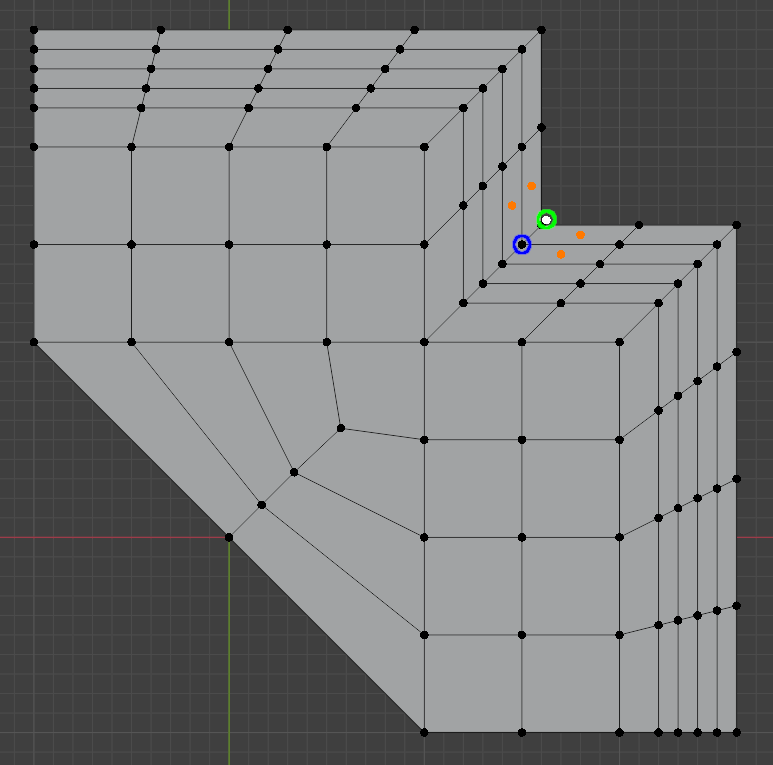
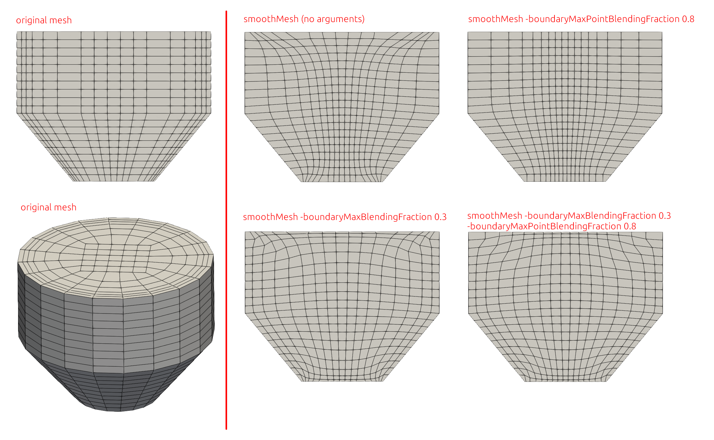
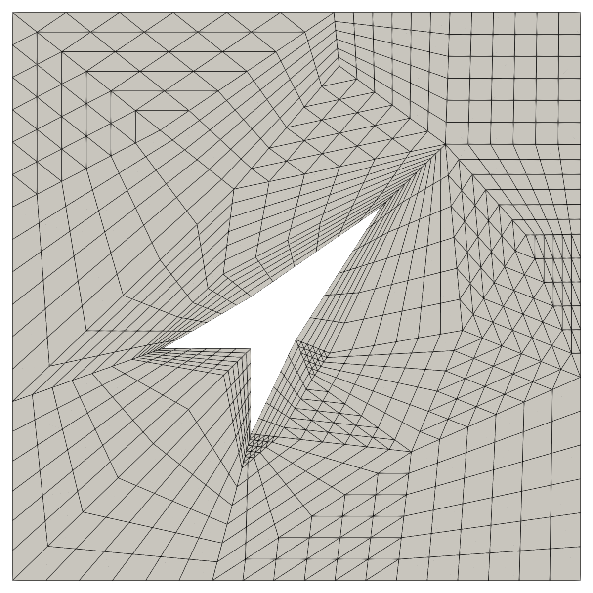
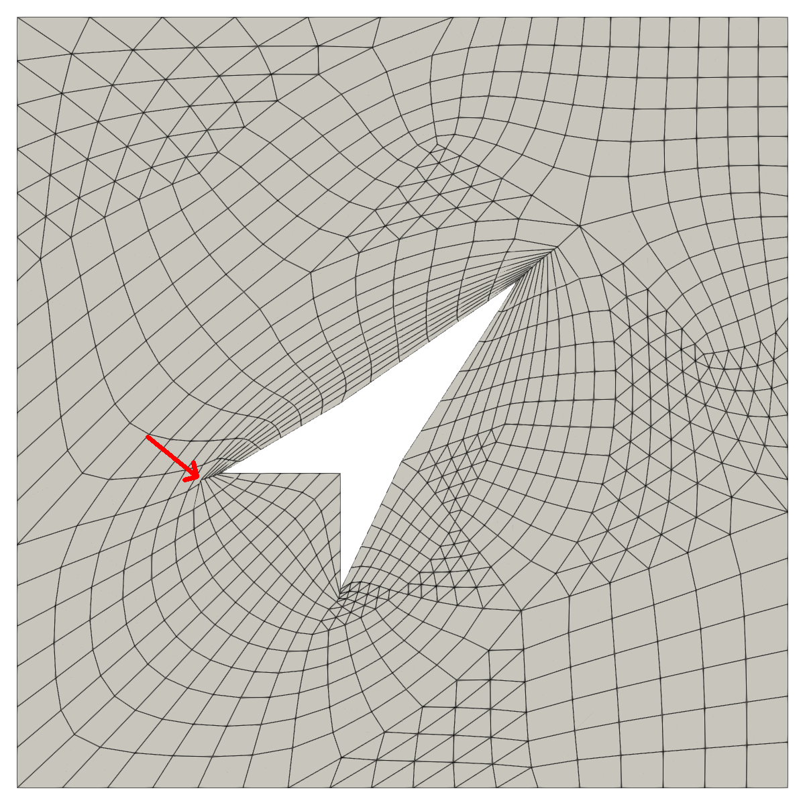
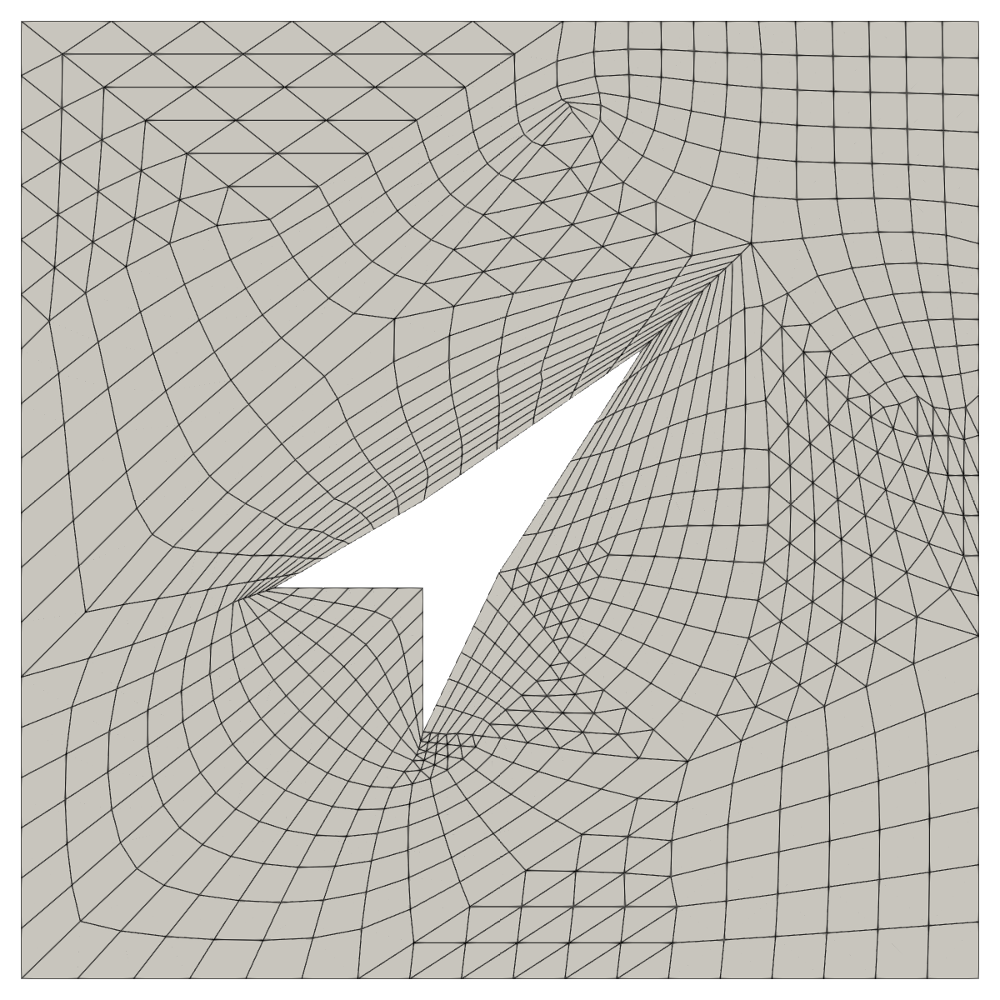
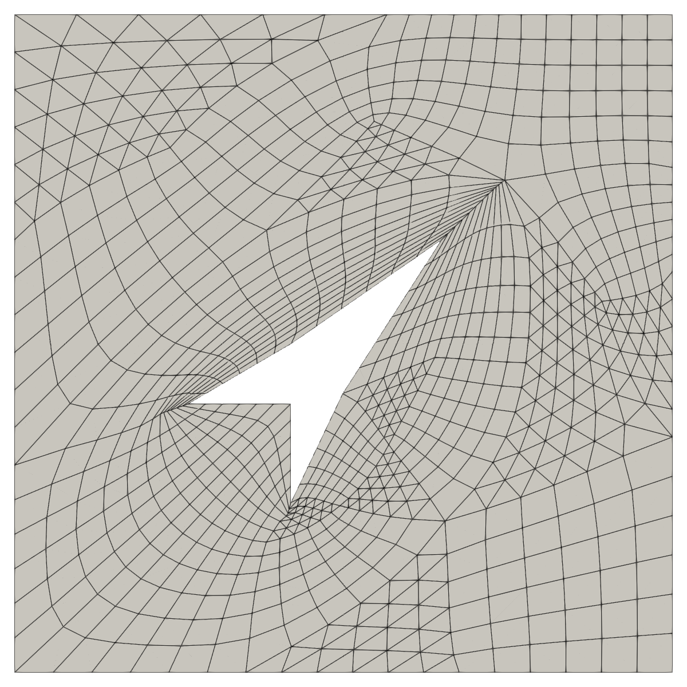
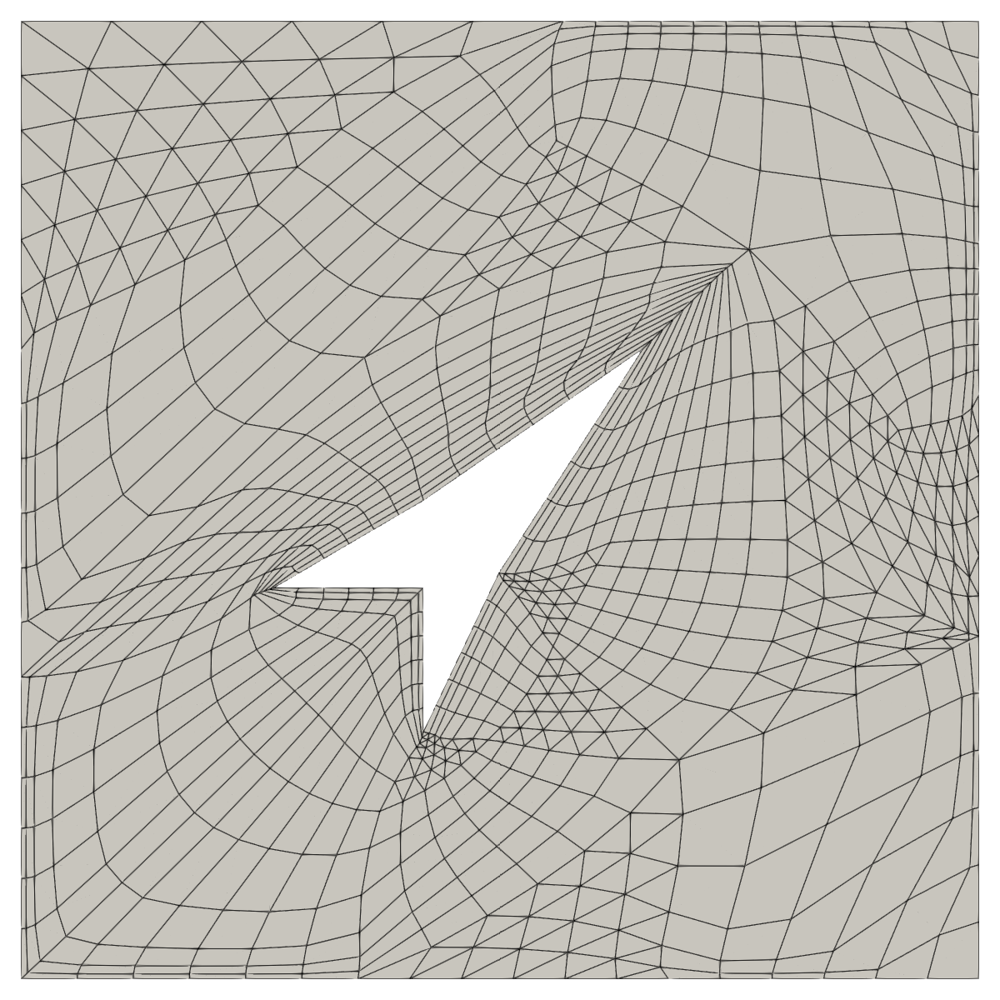
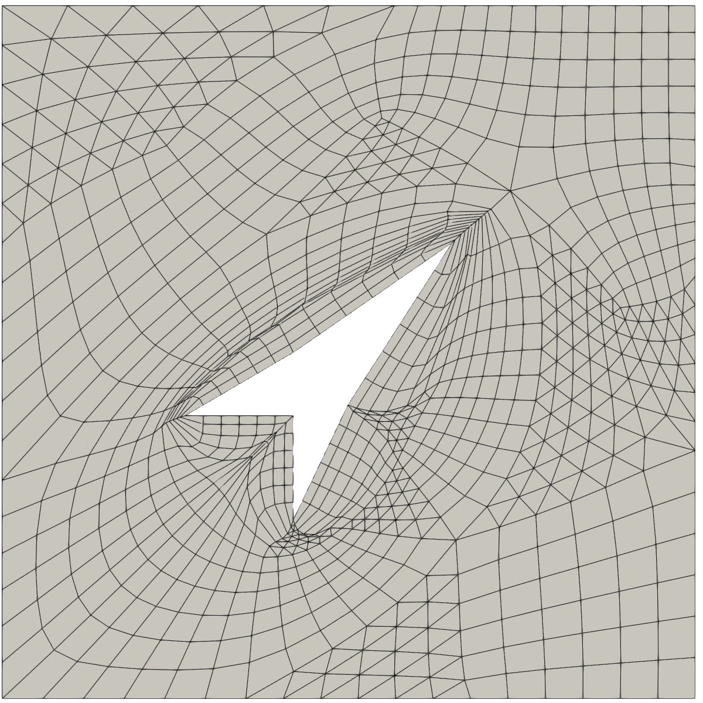

# smoothMesh



OpenFOAM mesh smoothing tool to improve mesh quality. Moves internal
mesh points by using primarily the Centroidal smoothing algorithm (a
version of the [Laplacian smoothing
algorithm](https://en.wikipedia.org/wiki/Laplacian_smoothing), which
uses surrounding cell centers instead of the neighbour point locations
to calculate the new point position). Midpoint of two closest points
is applied instead of centroidal point for prismatic high aspect ratio points.
Optional heuristic quality constraint options exist to constrain the
smoothing, to avoid self-intersections. No changes to mesh topology
are made.

Image below illustrates the need for restricting centroidal
smoothing. Without quality constraints, centroidal smoothing would
move the point highlighted in blue to the location highlighted with
green, which is outside of the domain. Thereby, unconstrained centroidal smoothing
can create self-intersecting cells, depending on the geometry and
topology of the mesh. Self-intersections can be avoided by using
additional quality constraints, which restrict the movement of
vertices.



## Current features and restrictions

- Works on 3D polyhedron meshes
- Works on both OpenFOAM.org v12 and OpenFOAM.com v2412 (likely also
  on older versions)
- Can be run in parallel
- Requires a consistent (not self-intersecting or tangled) initial
  mesh with "good enough" quality
- Smoothes internal mesh points
- Optional handling of prismatic boundary layers
- Limited boundary point smoothing (work in progress, see options
  below)

## Compilation instructions

You need to first source OpenFOAM in a terminal, then compile with
```
./Allwclean; ./Allwmake
```

You can optionally run the test cases (they will be copied to folder
`run_tests`) after compilation with
```
./run_tests.sh
```

## Command line options

### Basic options

- `-centroidalIters` specifies the maximum number of smoothing iterations (default 1000).

- `-relTol` is the relative tolerance convergence criteria for stopping smoothing iterations (default 0.02). If residual (average length of point movement relative to `maxStepLength`) drops below this value, then smoothing is ended.

- `-minEdgeLength` defines edge length below which edge points are fully frozen at their current location. Freezing happens only if edge length would decrease during smoothing. Edge length is allowed to increase regardless of this value. If no value is provided, a default value of half the length of the shortest edge in the initial mesh is applied.

- `-maxStepLength` is the maximum allowed length (in metres) for moving a point in one iteration. Smoothing process seems to be stable when this value is in the range 10% - 50% of the minimum cell side length. If no value is specified, a default value of 0.3 times the `minEdgeLength` is applied.

- `-relStepFrac` is a relative step scaling factor, which scales the local step length proposed by smoothing algorithms. It is applied to increase stability of the smoothing process (default value 0.5).

- `-totalMinFreeze` option causes mesh points on all edges shorter than `-minEdgeLength` to freeze, even if edge length would increase in smoothing (default false). This option is useful to keep boundary layers in the mesh unmodified, and smooth the large cells only, if the special boundary layer related options below are not used.

### Quality constraint options

The following options are related to additional **heuristic quality control constraints for smoothing**. The constraints work by disallowing movement of point (freezing of points) if the movement would cause quality of the mesh to suffer too much. Without constraining, centroidal smoothing may squish cells and create self-intersecting cells e.g. near concave geometry features, depending on the mesh details. Have a look at [the algorithm description document](algorithm_description.md) for details.

- `-edgeAngleConstraint` boolean option enables an additional quality control which restricts decrease of smallest edge-edge angle below `minAngle` (default is true).

- `-faceAngleConstraint` boolean option enables an additional quality control which restricts decrease of smallest and largest face-face angle below `minAngle` and above `maxAngle` (default is true).

- `-minAngle` option defines the value for minimum angle (in degrees, default value 35).

- `-maxAngle` option specifies the value for maximum angle (in degrees, default value 160).

- Note: `-minAngle` value causes point freezing *only* if the minimum angle is below this value and if the minimum angle would *decrease* in smoothing. Points are allowed to move if the minimum angle value *increases* with smoothing, regardless of this value. The same applies for the `-maxAngle` option: Freezing takes place only if maximum angle is above the specified value and if the maximum angle would *increase* in smoothing.

### Boundary layer related options

The options below are related to handling of prismatic cells near mesh boundaries, to either preserve or improve the orthogonality and the thickness of boundary layer cells in the mesh. If the mesh contains prismatic boundary layers, the unconstrained centroidal smoothing will tend to bloat the boundary layer cells into normal size. That can be avoided using the options below. These options affect only the prismatic cell edges near the mesh boundaries (see [the algorithm description document](algorithm_description.md) for details).

Warning: This is an experimental feature!

- `-boundaryMaxBlendingFraction` is the maximum fraction (0 <= value <= 1) by which boundary layer edge length and edge direction are blended with the centroidal smoothing locations. Zero value disables the effect of all other boundary related variables below (default 0). Values like 0.3 or 0.8 seems to produce good results in practice.

- `-boundaryEdgeLength` specifies the target thickness for the first boundary layer cells (prismatic side edge length). If no value is provided, the value of `minEdgeLength` is applied.

- `-boundaryExpansionRatio` specifies the thickness ratio by which the boundary edge length is assumed to increase (default: 1.3).

- `-boundaryMinLayers` is an integer value specifying the number of boundary layers which experience a full force of boundary blending specified with the `-boundaryMaxBlendingFraction` option (default: 1).

- `-boundaryMaxLayers` specifies the number of boundary cell layers beyond which boundary blending options above ceases to affect smoothing, and only centroidal smoothing is applied (default: 4).

- `-patches` option can be used to limit the boundary layer treatment to specified patches only. You can specify one or several patches, optionally with wild cards. For example `-patches 'walls'` or `-patches '( stator "rotor.*" )'`. All patches are affected by default.

## Boundary point smoothing options

Currently smoothMesh has only limited capability to smoothen the
points located on the boundary patches.

Warning: This is an experimental feature!

- `-boundaryMaxPointBlendingFraction` is the maximum fraction (0 <= value <= 1) by which boundary points are projected orthogonally to the boundary from the first layer prismatic points. Value like 0.8 seems to produce good results in practice. Note: Projection is made only if the boundary faces surrounding the boundary form a flat surface.

- `-boundaryPointSmoothingPatches` option can be used to limit the boundary point projection defined with the above option (`-boundaryMaxPointBlendingFraction`) to specified patches only. You can specify one or several patches, optionally with wild cards. For example `-patches 'walls'` or `-patches '( stator "rotor.*" )'`. All patches are affected by default.

**Note:** The combination of `-boundaryMaxBlendingFraction` and `-boundaryMaxPointBlendingFraction` gives different results, depending on the mesh and geometry. Figure below illustrates one example, showing a cross section in the middle of the mesh.




## Description of the algorithm

Please view [the algorithm description document](algorithm_description.md).


## Basic usage examples

You can run smoothMesh without providing any parameter values, but the result may not be very good, depending on your initial mesh. It is suggested to adjust at least the `-centroidalIters`, `-relTol`, `-maxStepLength` and `-minEdgeLength` options according to your case.

- Parallel run example: `mpirun -np 3 smoothMesh -centroidalIters 100 -maxStepLength 0.01 -minEdgeLength 0.05 -parallel`

- Serial run example: `smoothMesh -centroidalIters 100 -maxStepLength 0.01 -minEdgeLength 0.05`


## Test case

The folder `testcase` contains an artificial test case which contains
skewed and non-orthogonal cells, as well as variance in geometric
cell shapes and topology. This is meant to be a challenging (but not
impossible) task for centroidal smoothing.

Note: SmoothMesh has been developed further since this test was done
(5/2025), the test results below have not yet been updated!

[Video of the smoothing process](https://vimeo.com/1048255821) on a
horizontal cross-section.

Figures below illustrate how smoothing can go wrong (or right),
depending on the parameters applied.

This is the starting mesh:



Test 1 (bad results): No boundary layers, without faceAngleConstraint, produces self-intersections.
Full command: `smoothMesh -centroidalIters 100 -minEdgeLength 0.01 -maxStepLength 0.004 -faceAngleConstraint false`



Test 2 (bad results): No boundary layers, too large minAngle does not allow much smoothing.
Full command: `smoothMesh -centroidalIters 100 -minEdgeLength 0.01 -maxStepLength 0.004 -minAngle 45 -maxAngle 160 -faceAngleConstraint true`



Test 3 (good results): No boundary layers, faceAngleConstraint creates mesh without self-intersections.
Full command: `smoothMesh -centroidalIters 100 -minEdgeLength 0.01 -maxStepLength 0.004 -minAngle 15 -maxAngle 160 -faceAngleConstraint true`



Test 4 (bad results): Boundary layers without patches specification creates boundary layers on outer walls.
Full command: `smoothMesh -centroidalIters 100 -minEdgeLength 0.01 -maxStepLength 0.004 -minAngle 15 -maxAngle 160 -faceAngleConstraint true -boundaryMaxBlendingFraction 0.8 -boundaryEdgeLength 0.01`



Test 5 (good results): Boundary layers for patch named default, best result.
Full command: `smoothMesh -centroidalIters 100 -minEdgeLength 0.01 -maxStepLength 0.004 -minAngle 15 -maxAngle 160 -faceAngleConstraint true -boundaryMaxBlendingFraction 0.8 -boundaryEdgeLength 0.01 -patches '("def.*")'`


Test 6 (bad results): Boundary layers for patch named default, too large boundaryEdgeLength.
Full command: `smoothMesh -centroidalIters 100 -minEdgeLength 0.01 -maxStepLength 0.004 -minAngle 15 -maxAngle 160 -faceAngleConstraint true -boundaryMaxBlendingFraction 0.8 -boundaryEdgeLength 0.025 -patches '("def.*")'`




## Getting help and feedback

Please use Github issues section for reporting bugs. If you like this
tool, please star this repository in Github!

[Link to discussion thread on CFD-Online for discussions](https://www.cfd-online.com/Forums/openfoam-community-contributions/258267-smoothmesh-mesh-smoothing-tool-improve-mesh-quality.html)

### OpenFOAM Trade Mark Notice

This offering is not approved or endorsed by OpenCFD Limited, producer
and distributor of the OpenFOAM software via www.openfoam.com, and
owner of the OPENFOAM® and OpenCFD® trade marks.
