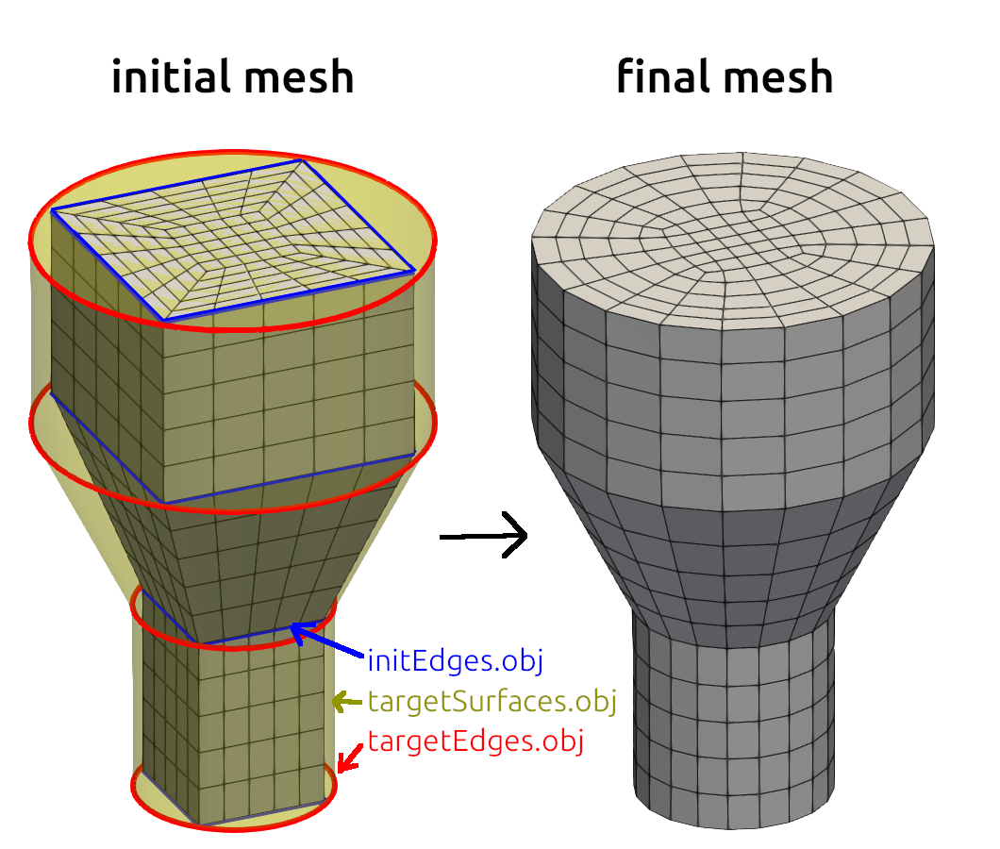

# smoothMesh


OpenFOAM mesh smoothing tool to improve mesh quality. Moves mesh points
by using primarily the Centroidal smoothing algorithm (a
version of the [Laplacian smoothing
algorithm](https://en.wikipedia.org/wiki/Laplacian_smoothing), which
uses surrounding cell centers instead of the neighbour point locations
to calculate the new point position). Midpoint of two closest points
is applied instead of centroidal point for prismatic high aspect ratio points.
Optional heuristic quality constraint options exist to constrain the
smoothing, to avoid self-intersections. No changes to mesh topology
are made.

Image below illustrates the need for restricting centroidal
smoothing. Without quality constraints, centroidal smoothing would
move the point highlighted in blue to the location highlighted with
green, which is outside of the domain. Thereby, unconstrained centroidal smoothing
can create self-intersecting cells, depending on the geometry and
topology of the mesh. Self-intersections can be avoided by using
additional quality constraints, which restrict the movement of
vertices.


## Current features and restrictions

- Works on 3D polyhedron meshes (2D meshes are not supported)
- Tested on both OpenFOAM.org v12 and OpenFOAM.com v2412 (likely works
  on older and possibly also on newer versions)
- Can be run in parallel or in serial
- Requires a consistent (not self-intersecting or tangled) initial
  mesh with "good enough" quality
- Smoothes internal and (optionally) boundary mesh points
- Optionally controls the thickness and orthogonality of prismatic
  boundary layers to preserve / create boundary layers using existing
  mesh cells
- Does not (yet) support meshes with baffles, periodic boundaries or
  multiple regions in the mesh.

## Compilation instructions

You need to first source OpenFOAM in a terminal, then compile with
```
./Allwclean; ./Allwmake
```

You can optionally run the test cases (they will be copied to folder
`run_tests`) after compilation with
```
./run_tests.sh
```

## Command line options

### Basic options

- `-centroidalIters` specifies the maximum number of smoothing iterations (default 1000).

- `-relTol` is the relative tolerance convergence criteria for stopping smoothing iterations (default 0.02). If residual (maximum length of point moved relative to `maxStepLength`) drops below this value, then smoothing is stopped.

- `-minEdgeLength` defines edge length below which edge points are fully frozen at their current location. Freezing happens only if edge length would decrease during smoothing. Edge length is allowed to increase regardless of this value. If no value is provided, a default value of half the length of the shortest edge in the initial mesh is applied.

- `-maxStepLength` is the maximum allowed length (in metres) for moving a point in one iteration. Smoothing process seems to be stable when this value is in the range 10% - 50% of the minimum cell side length. If no value is specified, a default value of 0.3 times the `minEdgeLength` is applied.

- `-relStepFrac` is a relative step scaling factor, which scales the local step length proposed by smoothing algorithms. It is applied to increase stability of the smoothing process (default value 0.5).

- `-totalMinFreeze` option causes mesh points on all edges shorter than `-minEdgeLength` to freeze, even if edge length would increase in smoothing (default false). This option is useful to keep boundary layers in the mesh unmodified, and smooth the large cells only, if the special boundary layer related options below are not used.

- `-writeInterval` option writes mesh at the interval of given number of iterations, e.g. value 10 causes write every tenth iteration (default value is same as `centroidalIters`).


### Quality constraint options

The following options are related to additional **heuristic quality control constraints for smoothing**. The constraints work by disallowing movement of point (freezing of points) if the movement would cause quality of the mesh to suffer too much. Without constraining, centroidal smoothing may squish cells and create self-intersecting cells e.g. near concave geometry features, depending on the mesh details. Have a look at [the algorithm description document](algorithm_description.md) for details.

- `-edgeAngleConstraint` boolean option enables an additional quality control which restricts decrease of smallest edge-edge angle below `minAngle` (default is true).

- `-faceAngleConstraint` boolean option enables an additional quality control which restricts decrease of smallest and largest face-face angle below `minAngle` and above `maxAngle` (default is true).

- `-minAngle` option defines the value for minimum angle (in degrees, default value 35).

- `-maxAngle` option specifies the value for maximum angle (in degrees, default value 160).

- Note: `-minAngle` value causes point freezing *only* if the minimum angle is below this value and if the minimum angle would *decrease* in smoothing. Points are allowed to move if the minimum angle value *increases* with smoothing, regardless of this value. The same applies for the `-maxAngle` option: Freezing takes place only if maximum angle is above the specified value and if the maximum angle would *increase* in smoothing.


### Boundary point smoothing options

Warning: This is a new and experimental feature!

SmoothMesh has a possibility to move and smooth also boundary points. The usage of this feature requires that the user provides following files in the `constant/geometry` folder in the case directory in Wavefront OBJ format:

- `constant/geometry/targetSurfaces.obj` (**required**). This **surface mesh** file must contain the target surface mesh for all boundary surfaces. The boundary points (other than feature edge points) are projected to closest triangulated surface mesh face provided in this file. The surface mesh can be generated e.g. by `Extract Surface` Filter in Paraview, or `surfaceMeshTriangulate` command in OpenFOAM.

- `constant/geometry/initEdges.obj` (**required**). This **edge mesh** file must contain the initial feature edges (sharp edges) of the whole initial mesh. This edge mesh is used to identify which points in the initial mesh are feature edge and corner points. The point classification information is saved to `isFeatureEdgePoint` and `isCornerPoint` files, and imported from those files upon consequtive runs, so that `initEdges.obj` does not have to be updated in between runs. Identification of points is based on projection of boundary mesh points to edges in `initEdges.obj`. Feature edge mesh can be generated e.g. by `Extract Surface` Filter followed by `Feature Edges` Filter in Paraview, or by `surfaceFeatures` or `surfaceFeatureExtract` commands in OpenFOAM.

- `constant/geometry/targetEdges.obj` (**optional**). This **edge mesh** file must contain the edge mesh locations for the final target mesh. If `targetEdges.obj` is provided, the points on the initial feature edges are projected to these edges during smoothing. If `targetEdges.obj` is not provided, then target edge mesh is assumed to be identical to the initial feature edge mesh. In practice, the result of providing no `targetEdges.obj` is that feature edges stay in their initial locations, but edge points may still move along the feature edges. However, providing `targetEdges.obj `allows projection of e.g. linear block mesh edges to curves.

Options for smoothMesh related to boundary point smoothing:

- `-smoothingPatches` option is used to limit the boundary point movement to specified patches only. You can specify one or several patches, optionally with wild cards. For example `-smoothingPatches '(walls)'` or `-smoothingPatches '(stator "rotor.*")'`. All patches are included in smoothing by default, so if you provide the above OBJ files in the constant/geometry directory, boundary point smoothing will be applied.

- `-internalSmoothingBlendingFraction` is related to how the location of the surface points on free boundaries (but not feature edges nor corners!) are calculated. Two methods are applied: Projection of coordinates from centroidal smoothing to closest boundary surface, and projection of inner mesh prismatic point to closest boundary surface. This fraction value specifies the blending (value between 0 and 1) for the inner mesh prismatic point. Value close to 0 means that centroidal smoothing dominates, which results in good boundary surface smoothing. Value close to 1 means that inner mesh point projection dominates, which results in highly orthogonal prismatic boundary edges at the cost of increased cell aspect ratio. The default value of 0 applies only centroidal smoothing. Note: More work is needed to study the effect of this value on the results.

**Note:** Always view the initial mesh and all OBJ files visually in Paraview for correctness before use!

Example from testcase4 is illustrated below.




### Boundary layer treatment related options

The options below are related to handling of prismatic cells near mesh boundaries, to either preserve or improve the orthogonality and control the thickness of boundary layer cells in the mesh. If the mesh contains prismatic boundary layers, the unconstrained centroidal smoothing will tend to bloat the boundary layer cells into normal size. That can be avoided using the options below. These options affect only the prismatic cell edges near the mesh boundaries (see [the algorithm description document](algorithm_description.md) for details).

Warning: This is an experimental feature!

- `-layerPatches` option is used to limit the boundary layer treatment to cells next to specified patches only. You can specify one or several patches, optionally with wild cards. For example `-layerPatches '(walls)'` or `-layerPatches '(stator "rotor.*")'`. No patches are included by default.

- `-layerMaxBlendingFraction` is the maximum fraction (0 <= value <= 1) by which boundary layer edge length and edge direction are blended with the centroidal smoothing locations. Zero value disables the effect of all other boundary related variables below (default value 0.3). Values below 0.5 seems to produce good results in practice, but it depends on the case.

- `-layerEdgeLength` specifies the target thickness for the first boundary layer cells (prismatic side edge length). If no value is provided, the value of `minEdgeLength` is applied.

- `-layerExpansionRatio` specifies the thickness ratio by which the boundary edge length is assumed to increase (default value 1.3).

- `-minLayers` is an integer value specifying the number of boundary layers which experience a full force of boundary blending specified with the `-layerMaxBlendingFraction` option (default value 1).

- `-maxLayers` specifies the number of boundary cell layers beyond which boundary blending options above ceases to affect smoothing, and only centroidal smoothing is applied (default value 4).


## Smoothing best practice

Currently, the best results I've encountered seem to result from carrying out smoothing in stages:

1. Free relaxation of initial mesh with `-layerMaxBlendingFraction 0 -internalSmoothingBlendingFraction 0`, so with boundary point smoothing, but without any layer treatment, and without imposing any orthogonality at boundary cells. If the original mesh contains boundary layer cells, they will be bloated into normal size cells.

2. Continue smoothing with small values for the above blending fractions, to pull in points towards boundaries, to create the boundary layers.

3. Continue smoothing with increased values for the above blending fractions if required. Possibly apply `-smoothingPatches 'none'` to freeze boundary points.

I don't yet have a more precise general recipe, it seems to depend on the case.


## Description of the algorithm

Please view [the algorithm description document](algorithm_description.md).


## Basic usage examples

The aim is to optimize smoothMesh in future so that the default parameter values would yield good end result for most common cases. However, the result may not be very good, depending on your initial mesh and geometry.

The most important parameters to adjust include `-centroidalIters`, `-relTol`, `-maxStepLength`, `-minEdgeLength` and `-minAngle` options according to your case.

- Parallel run example: `mpirun -np 3 smoothMesh -parallel -centroidalIters 10000 -maxStepLength 0.01 -minEdgeLength 0.05`

- Serial run example: `smoothMesh -centroidalIters 10000 -maxStepLength 0.01 -minEdgeLength 0.05`


## FAQ

**Q1. Why is the smoothing result uneven? Some groups of points are moved a lot, but neighbour points are frozen, or move only a litte.**

A1. This is due to quality constraints, which freezes points if smoothing move proposed by centroidal smoothing would decrease the mesh quality (min or max edge or face angle) below allowed limits. You can decrease the value of `-minAngle` parameter to allow more points to move during smoothing. However, the resulting mesh will then include very small angles, which likely means increase in mesh non-orthogonality.


## Test cases

The folders named like `testcaseX` contain test cases. E.g. the first `testcase` contains
skewed and non-orthogonal cells, as well as variance in geometric
cell shapes and topology. This is meant to be a challenging (but not
impossible) task for centroidal smoothing.

Note: SmoothMesh has been developed further since this test was done
(5/2025), the test results below have not yet been updated!

[Video of the smoothing process](https://vimeo.com/1048255821) on a
horizontal cross-section.

Figures below illustrate how smoothing can go wrong (or right),
depending on the parameters applied.

This is the starting mesh:


Test 1 (bad results): No boundary layers, without faceAngleConstraint, produces self-intersections.
Full command: `smoothMesh -centroidalIters 100 -minEdgeLength 0.01 -maxStepLength 0.004 -faceAngleConstraint false`


Test 2 (bad results): No boundary layers, too large minAngle does not allow much smoothing.
Full command: `smoothMesh -centroidalIters 100 -minEdgeLength 0.01 -maxStepLength 0.004 -minAngle 45 -maxAngle 160 -faceAngleConstraint true`


Test 3 (good results): No boundary layers, faceAngleConstraint creates mesh without self-intersections.
Full command: `smoothMesh -centroidalIters 100 -minEdgeLength 0.01 -maxStepLength 0.004 -minAngle 15 -maxAngle 160 -faceAngleConstraint true`


Test 4 (bad results): Boundary layers without patches specification creates boundary layers on outer walls.
Full command: `smoothMesh -centroidalIters 100 -minEdgeLength 0.01 -maxStepLength 0.004 -minAngle 15 -maxAngle 160 -faceAngleConstraint true -boundaryMaxBlendingFraction 0.8 -boundaryEdgeLength 0.01`


Test 5 (good results): Boundary layers for patch named default, best result.
Full command: `smoothMesh -centroidalIters 100 -minEdgeLength 0.01 -maxStepLength 0.004 -minAngle 15 -maxAngle 160 -faceAngleConstraint true -boundaryMaxBlendingFraction 0.8 -boundaryEdgeLength 0.01 -patches '("def.*")'`


Test 6 (bad results): Boundary layers for patch named default, too large boundaryEdgeLength.
Full command: `smoothMesh -centroidalIters 100 -minEdgeLength 0.01 -maxStepLength 0.004 -minAngle 15 -maxAngle 160 -faceAngleConstraint true -boundaryMaxBlendingFraction 0.8 -boundaryEdgeLength 0.025 -patches '("def.*")'`


## Getting help and feedback

Please use Github issues section for reporting bugs. If you like this
tool, please star this repository in Github!

[Link to discussion thread on CFD-Online for discussions](https://www.cfd-online.com/Forums/openfoam-community-contributions/258267-smoothmesh-mesh-smoothing-tool-improve-mesh-quality.html)

### OpenFOAM Trade Mark Notice

This offering is not approved or endorsed by OpenCFD Limited, producer
and distributor of the OpenFOAM software via www.openfoam.com, and
owner of the OPENFOAM® and OpenCFD® trade marks.
