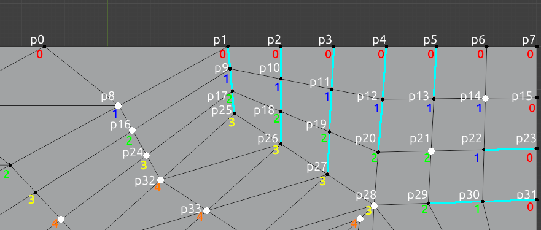
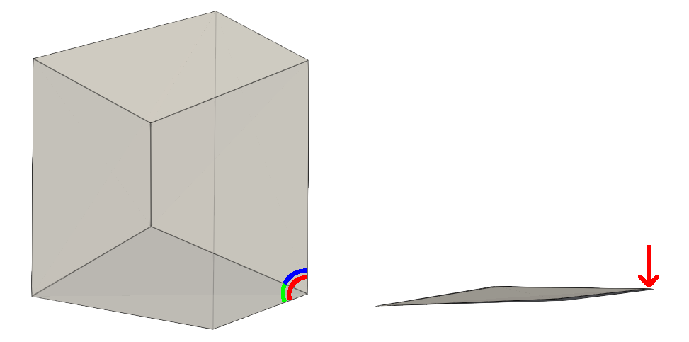
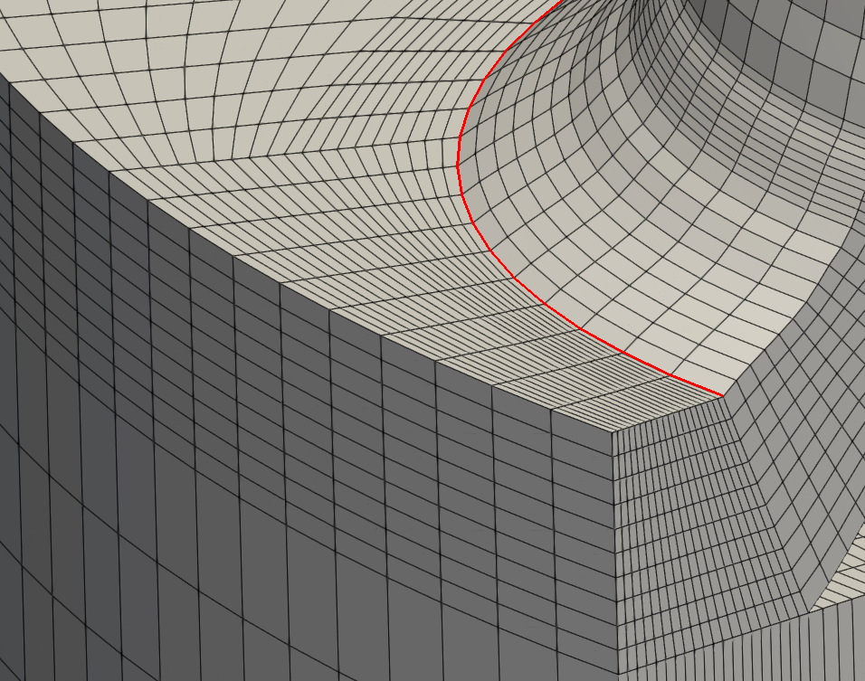
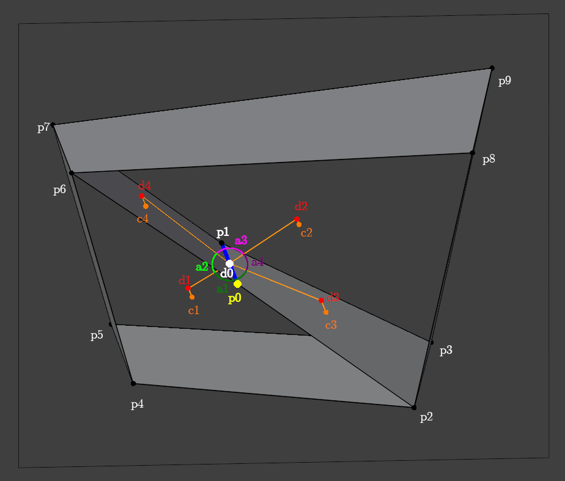

# SmoothMesh Algorithm Description

SmoothMesh applies two main stages for mesh smoothing:
A sequence of **Predictor algorithms** to *provide new
target coordinates for moving each mesh
point*, and **heuristic quality control constraints** to *disallow
movement if mesh quality would suffer too much*.

In the current implementation, the predictor algorithms starts with a
combination of **Centroidal smoothing** and **Midpoint of two closest
edge points** to come up with new point coordinates.
For **Boundary point smoothing**, different algorithms handle
corner points, feature edge points and free surface points.
There are additional **Boundary layer treatment** options to control the
thickness of prismatic cells next to boundaries, in order to move points
near boundaries to form boundary layers. 

## 1. Predictor algorithms

### 1.1. Centroidal smoothing

**Centroidal smoothing** is a version of the
[Laplacian smoothing algorithm](https://en.wikipedia.org/wiki/Laplacian_smoothing),
which uses surrounding cell centers instead of the neighbour point
locations to calculate the new target position for mesh points. The
absolute length of the movement of points in each iteration is limited
to a user given maximum step length value (`-maxStepLength` option),
to allow stable iteration during the smoothing process. Additionally
a relative step length factor (`-relStepFrac` option) is applied to
limit the local step length, to stabilize the smoothing while allowing
local relaxation.

### 1.2. Midpoint of two closest edge points

**The midpoint of two closest edge points** is linearly blended with
the point coordinate from Centroidal smoothing when the third shortest
adge is more then 1.5 times the length of the second shortest
edge. Midpoint is forced if the ratio is more than 3. This heuristic
is meant to deal with prismatic edges for high aspect ratio
cells. Centroidal smoothing tends to produce twisting or folding of
edges in this case, which needs to be avoided, as it can severly
increase non-orthogonality and face twisting.

## 2. Boundary point smoothing

Boundary point smoothing requires special treatment to obtain a wanted
shape for the mesh, since free centroidal smoothing would simply
contract the boundary. Boundary point smoothing requires three inputs:
**initial feature edge mesh**, **target feature edge mesh**, and
**target surface mesh**.

Based on the *initial feature edge mesh*, every boundary point of the
OpenFOAM polyMesh is initially classified as one of three categories:

- **Feature edge point** - All boundary points located within
  tolerance distance from the edges provided in the *initial feature
  edge mesh* (except corner points). Feature edge points
  will be projected onto the *edges* in the *target feature edge
  mesh* during smoothing.

- **Corner point** - Any boundary point where more or less than two
  feature edges meet in the initial feature edge mesh. These points
  will be projected to *closest corner point* in the *target feature
  edge mesh*.

- **Non-feature edge boundary point** - The remaining boundary points
  located elsewhere than on corners and on feature edges. These points
  will be projected to closest *face* on the *target surface mesh*.

Note: Separation of initial and target feature edges allows optional
morphing of boundaries, e.g. to project planar block mesh patches into
curving shapes. Because of this, the initial mesh does not have to
conform exactly to the shape of the final mesh, as boundary smoothing
takes care of projection. As a consequence, the setup of the simpler
initial mesh is faster.

Starting locations for the smoothing of the boundary points are
calculated by the predictor steps. On a high level, the locations are
then corrected for corner points, feature edge points and non-feature
edge boundary points as described above. As a final optional step, the
location of the non-feature edge boundary points is tuned towards the
location where the prismatic internal point is projected to the
surface. The strength of the tuning is controlled by the
`internalSmoothingBlendingFraction` option. This option can be applied
to improve the orthogonality of the boundary layer cells, at the cost
of increasing the aspect ratio of the boundary cells (depending on the
mesh). Feature edge smoothing applies the following exceptional
features to improve the smoothing results.

### 2.1. Separation of edge strings for feature edge projection

When a feature edge point is close to a corner point where three or
more feature edges meet, it is important to limit the edges eligible
for projection for that point, to avoid snapping to a wrong feature
edge. To avoid snapping to wrong edge, the *edge strings* (continuous
strings of edges connected to max two other edges) in the target edge
mesh are initially identified and labeled. Each edge is assigned a
string label accordingly. Each feature edge point is then initially
assigned a string label by proximity to target feature edges. During
smoothing, the projection on feature edges is then limited to edges
with a matching string label.

### 2.2. Calculation of the smoothing target for feature edge points

It was noted that a direct projection of the point from centroidal
smoothing back to the feature edge can cause extreme shortening of the
feature edges when the boundary mesh cells are skewed. To avoid this
skewing, the new location for feature edge points is calculated by
projecting the locations of the non-feature edge boundary points
connected to the feature edge point on the feature edge, and taking
the mean of those projections as a target. As a result, the smoothing
of feature edge points does not directly use centroidal prediction in
the smoothing process.

## 3. Boundary layer treatment

The boundary layer related options of smoothMesh allow identification
and special handling of prismatic cell edges near mesh
boundaries. This feature can be used to constrain centroidal smoothing
for boundary layers. Without constraining, the centroidal algorithm
tends to increase boundary layer cell thickness to match surrounding
cell size. Additionally, the orthogonal direction of boundary layer
cell edges may be skewed.

Shortly described, the algorithm first identifies the **prismatic
edges** in the mesh (cyan edges in the figure below), creates a
**mapping between edge points**, and uses that mapping to **propagate
the surface normal direction from a unique boundary point** along the
path of connected prismatic edges. These information, along with
target cell thickness for each boundary layer, are used to calculate
an **orthogonal point coordinate**, which is then blended with the
point coordinate from centroidal smoothing, using a **weight factor
dependent on the boundary layer number**. This algorithm is described
below in more detail.

**The identification of prismatic edges** is done by first calculating
**a number of edge hops to boundary** for all mesh points. Initially,
all points are assigned an *undefined hop value* (-1), and boundary points
are assigned a hop value of zero. Then the hop value are assigned for
internal points iteratively: The hop value of a point is the maximum
hop value of any neighbour point, incremented by one (undefined values
are not counted). This assignment of hop values iteratively results in
the number of point hops shown with colored numbers in the figure
above. Note that the edge hop value is also the number of boundary
layer for cells of a point located "towards" the boundary.

**The prismatic edges are identified from the hop values** of each point
simply by calculating the number of neighbour points with a hop value
*smaller than the hop number of current point*. If *only one* such
neighbour point exists, then the edge towards that neighbour is a
prismatic edge, which leads towards a unique boundary
point. This procedure results in the cyan edges shown in the figure
above.

Note that if there are more than one neighbour points with a hop value
smaller than current point's hop value, then it means that no unique
path to a single boundary point exists (white points in the figure
above). For example, point *p8* (part of a triangular face) has two
such boundary points as neighbour, *p0* and *p1*. Similarly, point *p14*
(part of quad face) has two such boundary points as neighbours, *p6* and
*p15*. These points are left free for centroidal smoothing.

The uniqueness of prismatic edge paths formed above is important, as
they can be used to propagate a target point normal direction for all
edge points along the path from the boundary point. Ideally, the
prismatic edge path should be orthogonal to boundary surface. That is,
the prismatic edges should align with the boundary point normal as
much as possible, so the boundary point normal direction is used for
aligning the prismatic edges.

The length of the prismatic edges is used an approximation for the
boundary layer thickness. Since the information of number of hops to
boundary is also available, it is possible to make the target for the
edge length a function of layer number. Currently, the target edge
length for each layer is calculated by using a *target thickness for
the first boundary layer* (specified with the `-boundaryEdgeLength`
option), which is then multiplied by an *expansion ratio*
(`-boundaryExpansionRatio` option) for the subsequent layers, to get
inflation of boundary layers.

Finally, the orthogonal target coordinates for each prismatic edge
point is calculated by using the current point coordinates of lower
edge point (the point closer to boundary), which is projected by
target edge length towards the direction specified by the boundary
point normal direction, to get the new orthogonal coordinates. Since
there are now two competing new coordinates for all internal prismatic
edge points (the orthogonal point coordinates, and the centroidal
point coordinates), a weighting function is used to blend the two into
a unique target. Currently, the weighting fuction uses a simple linear
interpolation with clamping. It is specified with a maximum blending
factor (specified with `-boundaryMaxBlendingFraction` option) which is
applied for layer numbers smaller than a given minimum number of
layers (specified with `-boundaryMinLayers` option). The linear part
of the orthogonal point weight drops to zero for layer numbers
exceeding a maximum number of layers (specified with
`-boundaryMaxLayers` option).

## 4. Heuristic quality control constraints

Unconstrained centroidal smoothing works well as such for cases where
the initial mesh quality w.r.t face non-orthogonality, face skewness
and cell aspect ratio is moderate. However, if the mesh contains
very low quality cells, then centroidal smoothing can produce either
self-intersecting or boundary-intersecting cells, depending on
the geometry. Therefore SmoothMesh applies additional
**heuristic quality control constraints** which constrain
point movement, to avoid mesh issues. All of the constraints
work by stopping the point movement, effectively "freezing" a point to
it's current coordinates, if quality would be decreased too much with
moving of the point.

The quality control constraints include the following, and they are by default
all evaluated in sequence:

### 4.1. Avoid shortening of short edge length

This constraint considers only **the minimum length of edges connected
to an internal point**. For each moving point, the minimum length of
all edges of the point are calculated first from current mesh, and
then assuming the point is moved to new coordinates. If new length is
below allowed minimum edge length (specified with the `-minEdgeLength`
option) and if the new minimum length is smaller than the current
minimum length, then the point is frozen.

This constraint is useful in the case where cells contain skewed and
high aspect ratio faces near boundaries. Centroidal smoothing can
cause uncontrolled edge length decrease and self-intersections in such
cases. For example, in the figure below, centroidal smoothing moves
the blue point to green point location.

### 4.2. Restrict decrease of smallest edge-edge angle

The idea of this contraint is
to use minimum of the angles of face edges meeting at a point as a
quality criteria: If the minimum edge-edge angle is below a threshold
value (e.g. 35 deg), and if the movement of the point to new
coordinates would decrease the minimum angle further, then
the mesh point movement is prohibited. However, the minimum
edge-edge angle doesn't decrease in cells which are flattened in such
a way that edges don't collapse on top of each other, like the example
cell in the figure below (top view on left, front view on right).

There are some edge cases where the edge-edge angle calculation is
necessary and where the face-face-angle restriction (described below)
fails to detect creation of self-intersecting cells. This was
encountered in a case where boundary point smoothing was applied and
where centroidal smoothing tends to collapse cells towards a curving
boundary feature (the red edge in the figure below)

### 4.3. Restrict deterioration of face-face angles

This constraint focuses only on **the minimum and maximum angle
between _cell faces_, which are connected to the all of the edges,
which surround a single mesh point**. The mesh edge-edge angles for
mesh points are not considered at all in this approach. For all mesh
points (not just internal points!), each point *p0* is processed as
follows (please view the example figure below):

- *Minimum and maximum face angles* are calculated for the point *p0* edges
  using the current mesh point locations in the
  calculation. Calculation procedure is described below in more
  detail.

- If the point *p0* is not frozen to the current coordinates,
  it is hypothetically moved to it's new
  coordinates. The effect of the move to the minimum and maximum face
  angles at *p0* are recalculated using new *p0* coordinates. If minimum
  or maximum face angle is deteriorated compared to current values,
  then *p0* is frozen.

- Each of the *p0* neighbour points (e.g. *p1*, *p2* and *p6* in the
  example figure below) are hypothetically moved (one at a time) to
  their new coordinates while other points remain at current
  coordinates (except *p0*, which is moved to it's new coordinates). The
  effect of the move to the minimum and maximum face angles at *p0* is
  calculated using new coordinates of the neighbour points. If minimum
  or maximum face angle at *p0* is deteriorated compared to current
  values, then *the neighbour point* is frozen. The frozen neighbour
  point is additionally processed again according to this procedure,
  to make sure face angle calculations are correct and no false
  improvements on the angles take place.

**The deterioration of face angle** is defined as:

- Minimum face angle is deteriorated if the minimum face angle is
  below a threshold value (value provided with option `-minAngle`,
  default value 35 deg), and the minimum angle would decrease if the
  move would be allowed.

- Maximum face angle is deteriorated if the maximum angle is above
  threshold (value provided with option `-maxAngle`, default value 170
  deg), and the maximum angle would increase if the move would be
  allowed.

### 4.4. The calculation method for face angles

Shortly put, the calculation of face angles at an edge is done by
first **projecting face and cell centers to an edge normal plane**,
and then **calculating and summing the angles from edge center to each
projected point**.

Figure below illustrates an example for the calculation of face angles
for a simple two cell case. For the sake of simplicity, the front and
back faces are not considered.

- Point *p0* in the figure is the point for which face angles are to
  be calculated, and the figure illustrates the calculation of face
  angles for the edge *p0-p1*. The edge center point is *d0*.

- There are two faces for this edge: First face *p0-p6-p7-p1* with
  face center at *c4*, and a second face *p0-p1-p3-p2* with face center
  at *c3*.

- The cell centers for the upper cell is *c2* and for the lower cell
  *c1*.

- Edge normal plane is defined as a plane located at *d0* with normal
  direction *p1-p0*. Each of the center points *c* are projected onto
  this plane, resulting in corresponding *d* points.

- Face angles are calculated from the projected *d* points by summing
  the angles between projected face and cell center coordinates
  with the edge center coordinates *d0*:

  - The face angle for lower cell is the sum of angles *a1* (angle from
    *d3-d0-d1*) and *a2* (angle from *d1-d0-d4*).

  - Similarly, the face angle for upper cell is the sum of angles *a3* (angle from
    *d4-d0-d2*) and *a4* (angle from *d2-d0-d3*).

The reason for using cell centers in the face angle calculation is
that it allows better evaluation of concave angles (>180 deg face
angles), like *a1+a2* in the figure.

